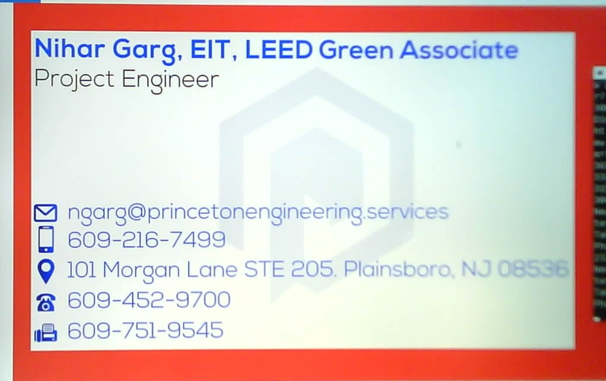
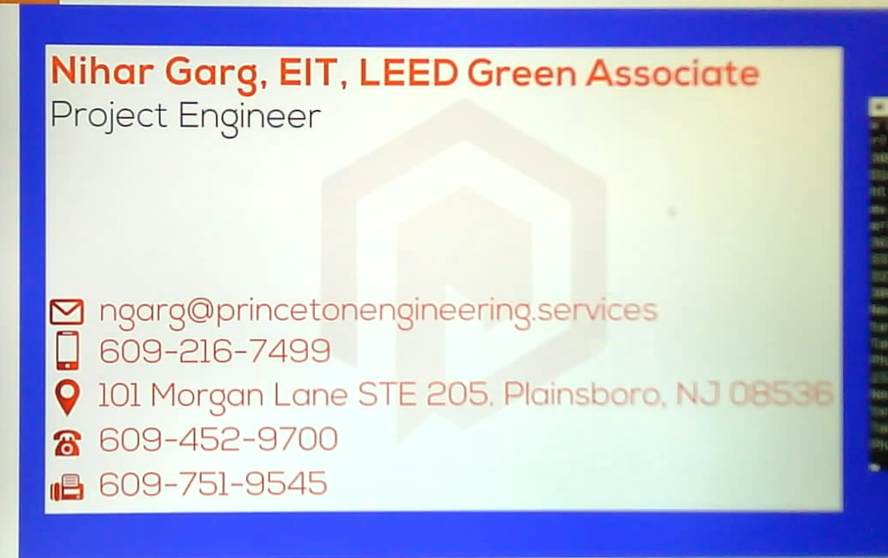

# How to perform Optical Character Recognition (OCR)

### Discover how to detect and OCR with OpenCV and Tesseract

### Implementations steps:
1. Take and save an image of the item (card/mailpiece/receipt) to be OCR'ed
  * This step is not included in this repository, but is as simple as clicking a picture using a camera and saving it to the local machine
  
    > 

2. Preprocessing the input image using OpenCV:
  * Apply edge detection to reveal the outline (detect the four corners) of the item in the image against the background
    * This step works well if there is sufficient contrast between the background and foreground
    
      > \
      > 
  
  * Detect contours in the edge map
  
    > 
  
  * Loop over all contours and find the largest contour with four vertices (corners)
  
    > 
  
  * Apply a perspective transform to obtain a top-down, bird’s-eye view of the item (required to improve OCR accuracy)
  
    > \
    > \
    > 

3. OCR the text on the top-down transform of the item using Tesseract
  * Extract data using Python regular expressions
  * Display the results on our terminal and save to a text file
  
    > Nihar Garg, EIT, LEED Green Associate\
    > Project Engineer\
    > ngarg@princetonengineering Services\
    > 609-216-7499\
    > 101 Morgan Lane STE 205, Plc\
    > 609-452-9700\
    > 609-751-9545

A special thank you to pyimagesearch.
